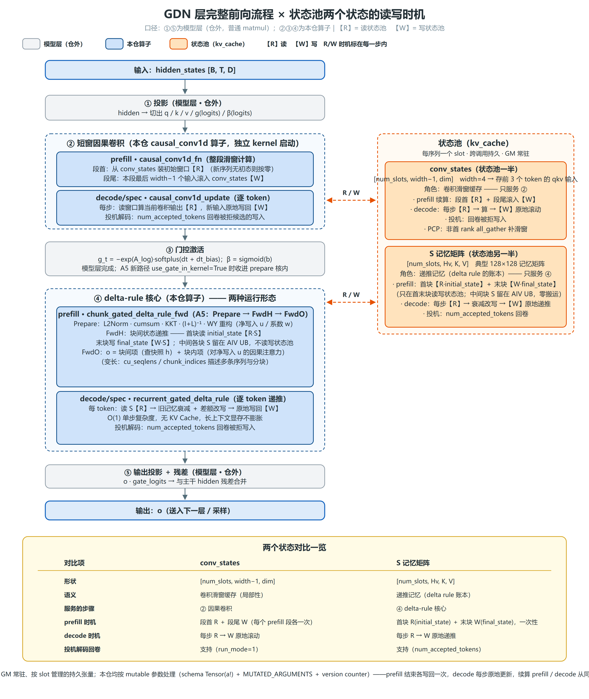
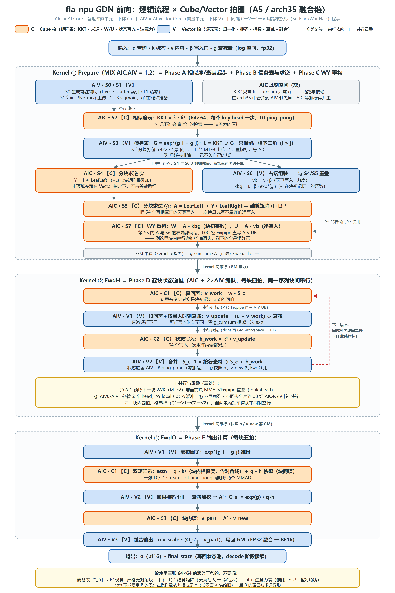
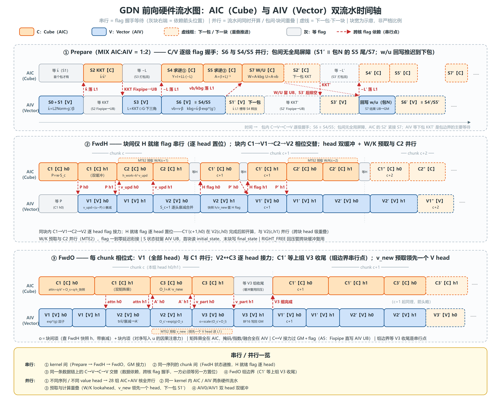

# GDN 原理梳理：算法逻辑流程与硬件流水

> 日期：2026-10-09
> 配图：本目录下三张图，本文按"层级 → 算子内步骤 → 硬件流水"三层展开，每层一张图
> 第 5 节的图到代码对应表可直接作为 profiling 打点索引使用

---

## 1. 三层视角总览

| 层 | 看什么 | 对应配图 |
| --- | --- | --- |
| 逻辑层（模型层） | GDN 层完整前向：投影 → 卷积 → 门控 → 核心 → 输出投影；状态池两个状态的读写时机 | 图 1 `gdn_layer_flow_states.png` |
| 算子层（kernel 内步骤） | 三个 kernel 各自的步骤序列，每步是 Cube 还是 Vector，步骤间串行/并行关系 | 图 2 `gdn_fla_npu_cv_flow.png` |
| 硬件层（流水时间轴） | AIC（Cube）/ AIV（Vector）两条流水随时间的排布、重叠与 flag 依赖 | 图 3 `gdn_fla_npu_pipeline.png` |

一句话：**kernel 之间串行（Prepare → FwdH → FwdO，GM 传数据）；kernel 内 Cube/Vector 两条流水用 flag 握手交替，握手之外的每一刻用并行填满。**

---

## 2. 图 1：层级流程图——模型层全链 + 状态池

**主干五步**（颜色区分仓内/仓外）：

1. **投影**（模型层，仓外）：hidden 切出 q / k / v / g(logits) / β(logits)；
2. **短窗因果卷积**（本仓 `causal_conv1d` 算子，独立 kernel）：每个 token 和前 width−1 个位置加权混合，补上局部性；
3. **门控激活**：g_t = −exp(A_log)·softplus(dt+dt_bias)，β = sigmoid(b)；A5 新路径 `use_gate_in_kernel=True` 时收进 prepare 核内；
4. **delta-rule 核心**（本仓算子）：prefill 走 chunked 流水线（Prepare → FwdH → FwdO），decode/spec 走逐 token 递推（`recurrent_gated_delta_rule`）；
5. **输出投影 + 残差**（模型层，仓外）。

**状态池两个状态（每序列一个 slot，GM 常驻，跨调用持久）**：

| | conv_states | S 记忆矩阵 |
| --- | --- | --- |
| 形状 | `[slots, width−1, dim]` | `[slots, Hv, K, V]` |
| 语义 | 卷积滑窗缓存（局部性） | 递推记忆（delta rule 账本） |
| 服务步骤 | ② 因果卷积 | ④ delta-rule 核心 |
| prefill 时机 | 段首 R + 段尾 W（每段各一次） | 首块 R(initial_state) + 末块 W(final_state)，一次性 |
| decode 时机 | 每步 R → W 原地滚动 | 每步 R → W 原地递推 |
| 投机回卷 | 支持（run_mode=1） | 支持（num_accepted_tokens） |

两者均为 mutable 参数（schema `Tensor(a!)` + `MUTATED_ARGUMENTS` + version counter）。

---

## 3. 图 2：Cube/Vector 分工图——算子内步骤

**Kernel ① Prepare**（MIX AIC:AIV = 1:2；产 g_cumsum / A / w / u）：

| 步骤 | 单元 | 计算 |
| --- | --- | --- |
| S0+S1 | V | 常驻辅助（I_vcs/索引/清零）；k̂=L2Norm(k) 传 L1；g′/β 准备 |
| S2 | C | KKT = k̂·k̂ᵀ（每 key head 一次，L0 双 bank 轮转） |
| S3 | V | G = exp*(g_i−g_j)；L = KKT⊙G 取严格下三角；leaf 打包传 L1 |
| S4 | C | Y = I + LeafLeft·(−L)（求逆第一步；I·I 预填充与 Vector 计算重叠） |
| S5 | C | A = LeafLeft + Y·LeafRight = (I+L)⁻¹（结算矩阵） |
| S6 | V | vb = v·β，kbg = k̂·β·exp*(g′) —— **与 S4/S5 并行**（无数据依赖） |
| S7 | C | W = A·kbg，U = A·vb（WY 重构；L0C 经 Fixpipe 直写 AIV UB） |

**Kernel ② FwdH**（每块四步 C1→V1→C2→V2；同一序列块间串行，是数学上的递推依赖）：

| 步骤 | 单元 | 计算 |
| --- | --- | --- |
| C1 | C | P = w·S_c（算回声） |
| V1 | V | v_update = (u − P)⊙衰减（扣回声，按各行写入时刻衰减） |
| C2 | C | h_work = kᵀ·v_update（64 个净写入一次矩阵乘全加上） |
| V2 | V | S_c+1 = 按行衰减⊙S_c + h_work（存快照 h、v_new；置 H 就绪 flag） |

**Kernel ③ FwdO**（每块五步）：

| 步骤 | 单元 | 计算 |
| --- | --- | --- |
| V1 | V | 衰减因子 exp*(g) 准备 |
| C1 | C | 双矩阵乘：attn = q·kᵀ（块内，含对角线）＋ O_s = q·h_快照（块间项） |
| V2 | V | 因果掩码 tril + 衰减加权 → A′；O_s′ = exp(g)·O_s |
| C3 | C | O_l = A′·v_new（块内项） |
| V3 | V | o = scale·(O_s′ + O_l)，FP32 融合后转 BF16 写回 |

**串行/并行规则**（详见第 4 节流水解释）：

- 串行：kernel 间；同序列块间（H 就绪 flag，逐 head）；同一条数据链上的 C→V→C→V（flag 握手）；FwdO 组边界（C1′ 等上组 V3 收尾）；
- 并行：不同序列/头跨核组；kernel 内 Cube/Vector 两条流水；预取与计算重叠；AIV0/AIV1 双 head 双缓冲。

---

## 4. 图 3：硬件流水图——AIC/AIV 双流水时间轴

**物理基础**：一组编队 = 1 AIC + 2 AIV。AIC 挂 L1（~512KB）→ L0A/B/C（矩阵乘缓冲），管道 MTE1（L1→L0）/ Fixpipe（L0C 出结果）；AIV 挂 UB（~256KB），管道 MTE2（GM→UB）/ MTE3（UB→GM）。**两类核的片上存储互相看不见**，每次 C↔V 接力理论上要过一圈 GM workspace——流水设计的目标就是让这笔"接力税"不出现在关键路径上。A5 缓解：AIC 的 L0C 结果可经 Fixpipe 直写配对 AIV 的 UB。同步靠 flag（SetFlag/WaitFlag），每个缓冲配 `XXX_READY / XXX_FREE` 一对，构成 ping-pong 双缓冲。

**三段流水的要点**：

1. **Prepare**：S6（V）与 S4/S5（C）两条流水同时开算；**包间无全局屏障**——AIC 的 S2′ 紧接 S7 开跑，包 N+1 的 S1′ 在 AIV 上与包 N 的 S5 尾段/S7 重叠（k̂ 与 −L 复用 L1 地址，需等包 N 的 S4 用完）。S7 的 W/U 经 Fixpipe 落 AIV UB 后**不立即回写**，推迟到下一包 S3′ 完成后的窗口才排空到 GM；AIV 在包边界等下一包 KKT′ 是主要的局部等待。
2. **FwdH**：块间串行是唯一硬约束（V2(c) 置 H 就绪 flag 后 C1(c+1) 才能开算；flag 逐 head 置位——C1(c+1,h0) 只等 V2(c,h0)，跨块仍有 head 级重叠）。三个填空手段——**head 双缓冲**（AIV0 管 head 0/2、AIV1 管 1/3，L0 双 bank 轮转）；**lookahead 预取**（AIC 算当前块 C2 时 MTE2 已在搬下一块 W/K，flag 一到零延迟开算）；**状态驻留**（S 全程住 AIV UB，仅首块读 initial_state、末块写 final_state，中间零 GM）。
3. **FwdO**：每 chunk 相位式推进——AIV 先算完本组全部 head 的 V1（gate 因子），与 AIC 的 C1（双矩阵乘）**并行**（C1 只等预取事件，不等 V1）；随后 V2↔C3 逐 head 接力（attn→A′→v_part），V3 融合收尾；C3 的 v_new 预取**领先一个 V head**，操作数（A′/v_new 都是 AIV 刚产出的热数据）提前进 L1。组边界是串行点：下一组的 C1′ 要等本组 V3 全部收尾（缓冲复用回压）。

**图外的两层并行**：① 核组间——host 把 (序列， value head) 展平成 head task 均分给 28 组核，不同序列/头全并行；② **H/O 块级流水**（perf 分支）——16 组生产者跑 FwdH + 12 组消费者跑 FwdO 同时开工，FwdH 每完成一个 (块， 头) 用 IBSet 原子置位，FwdO 的消费任务 IBWait 自旋等对应槽位，前面的块还在 FwdH 手里时后面的块已在 FwdO 被消化，消掉了全局屏障的空泡。

---

## 5. 图到代码对应表（profiling 打点索引）

> 打点建议（配合 AscendTimerV2）：相位边界 + FwdH 四步 / FwdO 五步内部 + workspace 读写两侧；动态项用块号。目标是把四个未知数变成数字：**相位耗时、flag 空泡、workspace 税、L2 命中率**。

| 图中元素 | 代码位置 |
| --- | --- |
| 整链 host 编排 / tiling | `fla/ops/ascendc/gdn/chunk_gdn_fwd/chunk_gated_delta_rule_fwd/op_host/chunk_gated_delta_rule_fwd_tiling.cpp`、`op_host/op_tiling/arch35/chunk_gated_delta_rule_fwd_arch35_tiling.cpp` |
| A5 三 kernel 分发（Prepare→H→O） | `.../chunk_gated_delta_rule_fwd/op_kernel/internal/arch35/chunk_gated_delta_rule_fwd_arch35.cpp` |
| Prepare S0–S7 | `.../chunk_gdn_fwd/chunk_gated_delta_rule_fwd_prepare/op_kernel/arch35/chunk_gated_delta_rule_fwd_prepare.h`（`Stage0_GenerateResidentAux` … `Stage7_AicOne`） |
| FwdH C1/C2（Cube 侧） | `.../chunk_gdn_fwd/chunk_fwd_h/op_kernel/arch35/chunk_fwd_h_cube.h`；融合链内部版 `.../chunk_gated_delta_rule_fwd/op_kernel/internal/operators/chunk_gated_delta_rule_fwd_h/op_kernel/arch35/gemm/kernel/gdn_fwd_h_kernel.hpp` |
| FwdH V1/V2（Vector 侧） | `.../chunk_gdn_fwd/chunk_fwd_h/op_kernel/arch35/chunk_fwd_h_vec.h` |
| FwdO C1/C3（双矩阵乘 / A′·v） | `.../chunk_gdn_fwd/chunk_fwd_o/op_kernel/arch35/chunk_fwd_o_cube.h`（`ProcessStage2Head` / `ProcessStage4Head`）；融合链内部版 `.../internal/operators/chunk_fwd_o/op_kernel/gemm/kernel/gdn_fwd_o_kernel.hpp` |
| FwdO V1/V2/V3 | `.../chunk_gdn_fwd/chunk_fwd_o/op_kernel/arch35/chunk_fwd_o_vector.h`（`Stage1Gate64VF` / `Stage3Gate64VF` / `Stage5Fuse64VF`） |
| FwdO 入口 / AIC·AIV 分支 | `.../chunk_gdn_fwd/chunk_fwd_o/op_kernel/arch35/chunk_fwd_o_a5.h` |
| H/O 块级流水（IBSet/IBWait） | `.../chunk_gated_delta_rule_fwd/op_kernel/internal/arch35/ho_pipeline_context.h`（`HoPipelineContext`）；构建于 `chunk_gated_delta_rule_fwd_arch35.cpp` 的 `BuildHoPipelineContext` |
| ② 因果卷积（prefill/decode 两入口） | `fla/ops/ascendc/gdn/gdn_preprocess/causal_conv1d/`（kernel：`op_kernel/causal_conv1d.h`） |
| ④ decode 递推 | `fla/ops/ascendc/gdn/recurrent_gdn/recurrent_gated_delta_rule/` |
| Python 稳定入口 / mutable 契约 | `torch_custom/fla_npu/fla_npu/ops/ascendc/_stable.py`（`npu_causal_conv1d_fn/_update` 等）、`.../ops/ascendc/__init__.py`（`MUTATED_ARGUMENTS`） |

**打点位置与图中元素的对应**：

- "相位空泡"打在 kernel 边界（Prepare 末尾 → FwdH 块 0 的 C1 前；FwdH 末块 → FwdO 块 0 的 V1 前）；
- "flag 空泡"打在每个 READY flag 的 Wait 前后（FwdH 的 `P_READY/D_READY/RIGHT_READY/H_READY`，FwdO 的 pair handshake）；
- "workspace 税"打在 MTE3 写 GM 与对端 MTE2 读 GM 的两侧（FwdH 的 right、h/v_new 快照）；
- "L2 命中率"按 workspace 段分别统计（A、w、u、h、vNew 各段）。

---

## 6. 结论

**流水的本质**：串行是数据依赖逼的（kernel 链、块间递推、步骤间接力），并行是把每个等待窗口用另一条流水、另一个 head、下一块的预取或另一个核组填满。当前已有四层并行：C/V 两条流水、ping-pong 双缓冲、lookahead 预取、核组分片 + H/O 块级流水。
